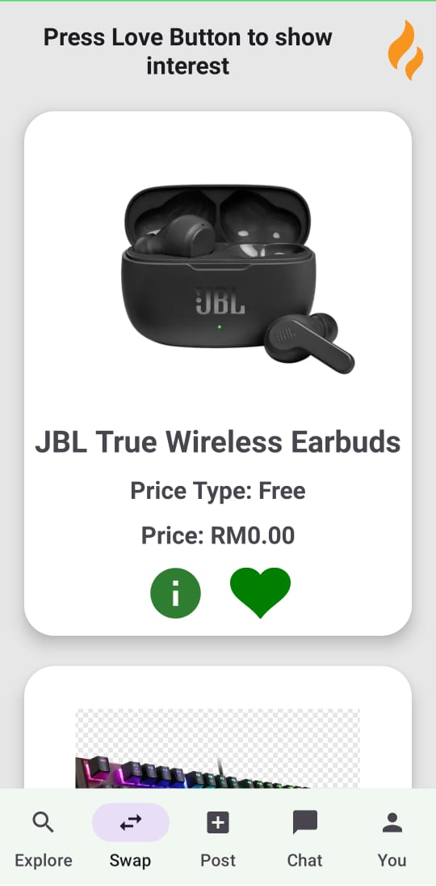
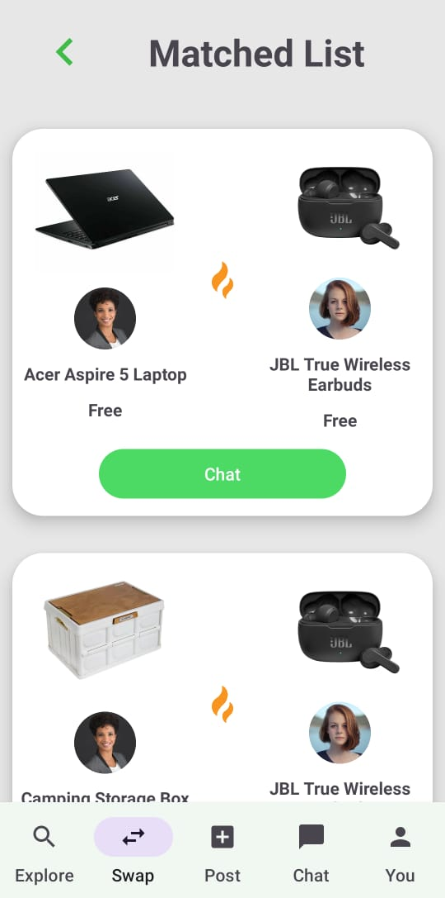

# Second-Chance-Mobile-App
## Project Overview
The Second-Chance-Mobile-App is a mobile application designed to facilitate the buying, selling, or exchanging of second-hand items. With a user-friendly interface, it aims to connect individuals interested in reusing and repurposing items, thereby promoting sustainability and reducing waste.

## Project Highlight
- Swap Screen: Implemented a dedicated screen where users can browse and like second-hand items they are interested in.
- Matched List Screen: Developed a feature that showcases a list of matched items between users who have liked each other's items.

## Project Screenhsot

